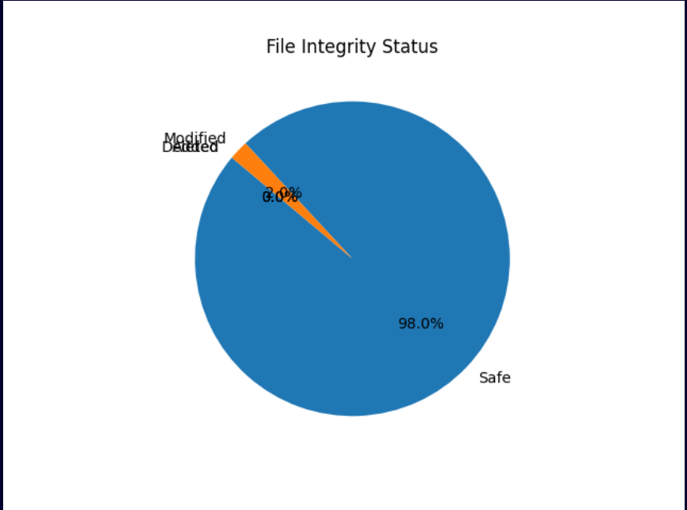

# 🧠 File Integrity Verification and Tamper Detection Tool

This project helps forensic investigators verify the integrity of digital evidence files.  
It generates hash-based baselines and detects any unauthorized modifications.

---

## 🧩 Features

- Generates baseline report with cryptographic hashes
- Detects file modifications, deletions, and additions
- Generates JSON report and pie chart visualization

---

## 🧰 Technologies Used

Python, hashlib, matplotlib, JSON

---

## ⚙️ Usage

Run the tool using:

```bash
python file_integrity_tool.py
Select:
1️⃣ Create baseline
2️⃣ Verify integrity

📊 Example Output
🖥️ Console Output
<p align="center"> </p>
📈 Integrity Summary (Pie Chart)
<p align="center"> </p>
📁 Example Files Generated

baseline_report.json — stores original hash values

integrity_summary.png — shows pie chart of file status

👨‍💻 Author

Henil Patel
CY6012 – Digital Forensics and Investigation
TechCorp Enterprises
```
